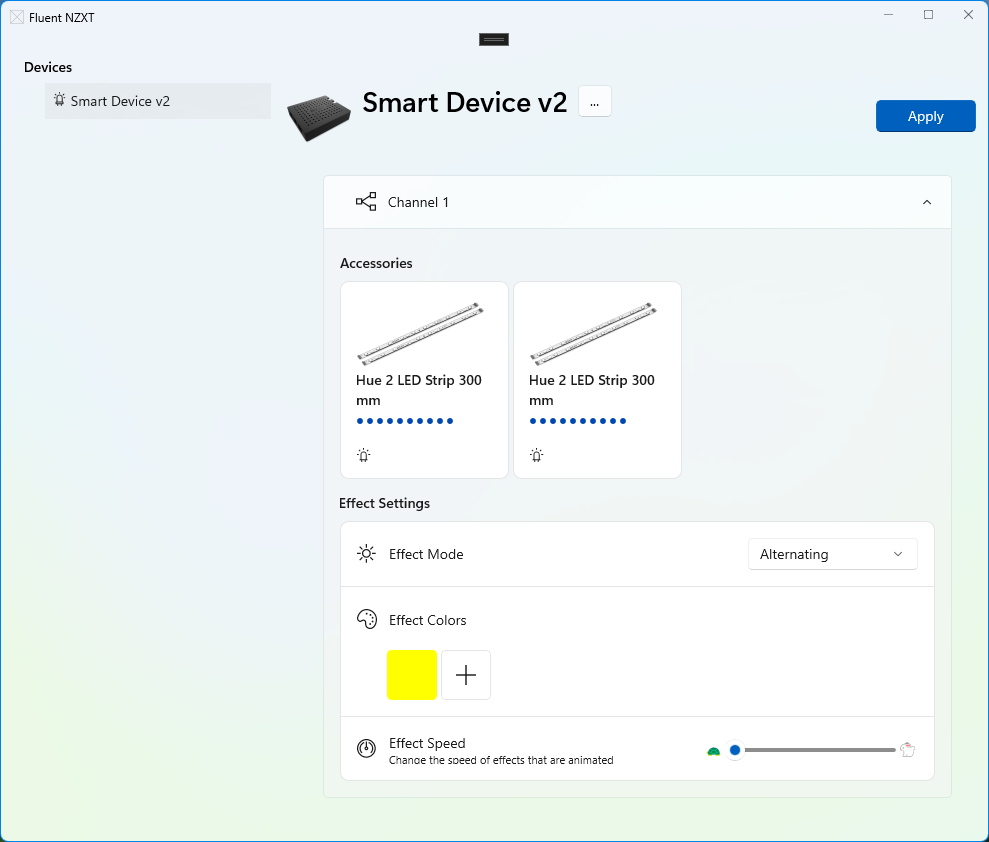

# FluentNzxtApp
Fluent design NZXT config app. Supports [NZXT SmartDevice v2 Controller](https://nzxt.com/product/rgb-and-fan-controller) and all accessories (see: `NzxtLib\Hue2Accessory.cs` for a complete list).

Features:
* Fluent design, written in WinUI3
* Supports multiple effect modes
* Native HID handling, no external libraries to communicate to the device

